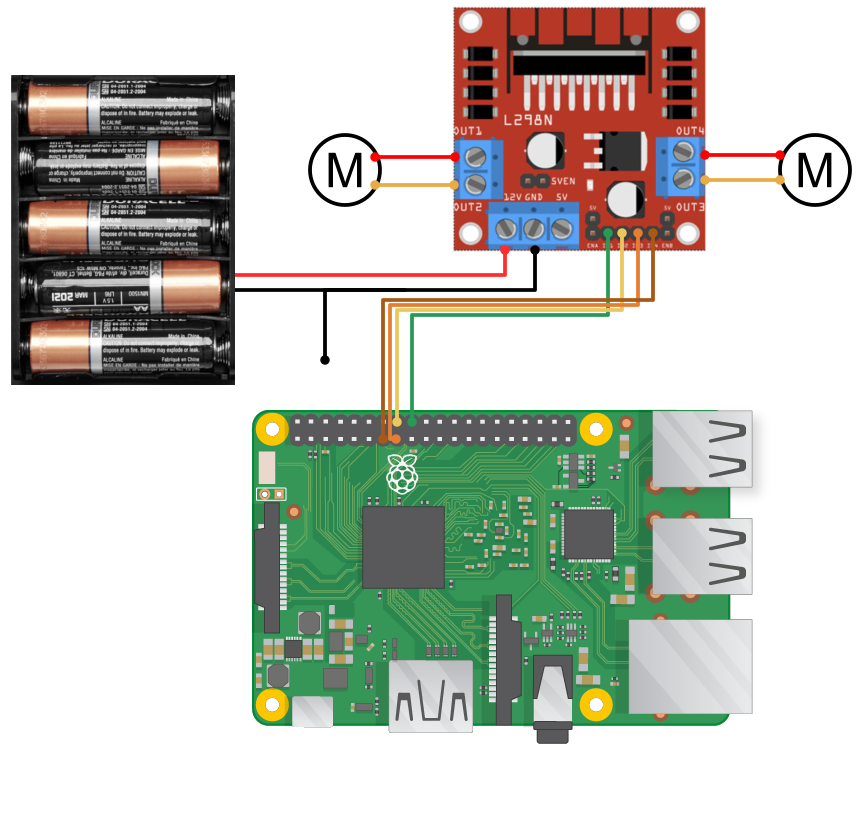

# Ball Tracking Robot
This project leverages computer vision to detect and track a ball using a camera connected to a Raspberry Pi. The minicomputer also controls two DC motors on a car through an L298 motor driver.

| **Engineer** | **School** | **Area of Interest** | **Grade** |
|:--:|:--:|:--:|:--:|
| Aiden L | Palo Alto High School | Electrical Engineering | Incoming Sophomore

# Second Milestone

My second milestone deals with all computer vision. Here, I set up a live camera feed with `picamera2` and used `cv2` to find the center of the ball and approximate its radius. 

The main part of the code includes: 
1) **Image Capture**: Capturing a photo with `Picamera2.capture_array()` and converting its RGB data to HSV with `cv2.cvtColor()`; 
2) **HSV Thresholds**: Creating two HSV thresholds (upper and lower bounds) with `cv2.inRange()` and combining them with a bitwise OR (we use two thresholds because red wraps around hue in HSV from 1-10 and 170-180); this should result in a binary (black + white) mask with white pixels representing red pixels in the image; 
3) **Noise Filtering**: Average and erosion filters with `cv2.blur()` and `cv2.erode()` to filter out noise; at the end of this step, we should be left with all white pixels in the image representing the ball; 
4) **Ball Detection**: Finding contours (outlines made out of white pixels from the binary mask) with `cv2.findContours()`, and fetching the ball (contour with the largest area) using `cv2.contourArea()`; 
5) **Visualization**: Calculating the smallest circle that can surround the ball contour with `cv2.minEnclosingCircle()` and drawing the contour, circle, and its center with `cv2.circle()` and `cv2.drawContours()`. 

Two helper utilities were added to speed up testing:
- Live HSV Inspector: fetches the HSV of any pixel that I hover over
- Real-time Mask Adjustment: modify the HSV thresholds in real time by pressing keys to avoid rerunning code.

# First Milestone

<iframe width="560" height="315" src="https://www.youtube.com/embed/kIgdshT56f0?list=PLe-u_DjFx7eui8dmPGji-0-slT8KydYv_" title="Aiden L. Milestone 1" frameborder="0" allow="accelerometer; autoplay; clipboard-write; encrypted-media; gyroscope; picture-in-picture; web-share" referrerpolicy="strict-origin-when-cross-origin" allowfullscreen></iframe>

My first milestone aims to assemble the main components of the ball tracking robot, which includes: 
- **Chassis**: as the base of the car.
- **L298N Motor Driver**: uses two H-bridges to allow changes in speed and direction for two motors.
- **Raspberry Pi**: a mini computer to bring all the components together on a high level, processing images and steering the robot. 
- **Pi Camera**: a small camera to use for object detection
- **Breadboard**: to connect components without soldering, right now only used to ground the Pi and battery pack together.
- **Battery Pack**: to power the motors.

| 
|:--:|
|Assembly of the main components|

The wiring is quite simple; the Raspberry Pi and the battery pack are grounded together on the breadboard, then connected into the GND input of the L298N motor driver. Four GPIO pins from the Pi are connected to the IN1-IN4 ports of the L298N. The battery pack's positive lead is connected to the 12V input of the driver. Finally, the four output pins of the motor driver are wired to two motors attached to the wheels.

Additionally, I tested the camera with `libcamera-vid -t 0` and a VNC connection to view the preview, and tested the motors with a simple script.

But although relatively simple, this milestone took six days to complete. This was primarily due to numerous mistakes with soldering wires to components (ex. motors, power button), causing the wires to fall off or snap, as well as problems with the Raspberry Pi (had to replace it and the SD card) and a defect in my L298N missing its regulator jumper, making it unable to power on with my two inputs (12V and GND). Luckily there is not much hardware integration in the future milestones, so it should (hopefully) be "smoother" sailing from here. 

I plan to start implementing object detection and the provided ultrasonic sensors to identify and track the ball next. 

# Starter Project
<iframe width="560" height="315" src="https://www.youtube.com/embed/1uRjqW9JUWU?si=RzlLivTnppujge-3" title="YouTube video player" frameborder="0" allow="accelerometer; autoplay; clipboard-write; encrypted-media; gyroscope; picture-in-picture; web-share" referrerpolicy="strict-origin-when-cross-origin" allowfullscreen></iframe>

For my starter project I soldered an RGB slider together, which involved three sliders, an LED light, and a USB-C connector soldered to a PCB. 
The sliders act as **potentiometers**, or variable resistors, and can increase or decrease the current (by adjusting resistance) through each LED channel (red, green, and blue). By blending the current for red, green, and blue inside the LED, we can mix colors. 

|  |
|:--:|
|Blending red and blue to make purple|

# Schematics
|  |
|:--:|
|Schematic for milestone 1 wiring|

