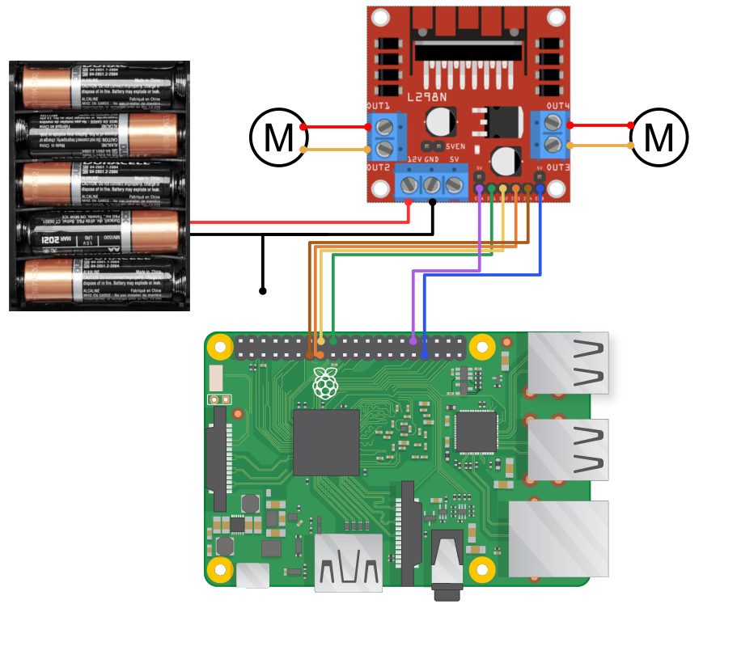
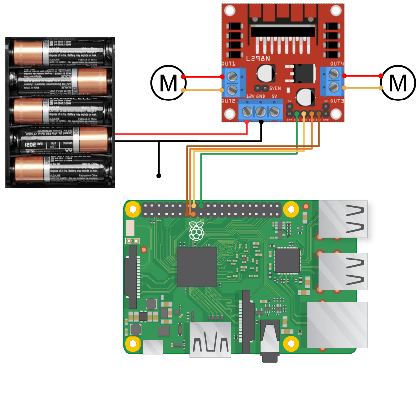

# Ball Tracking Robot
This project leverages computer vision to detect and track a ball using a camera and two motors connected to a Raspberry Pi.

| **Engineer** | **School** | **Area of Interest** | **Grade** |
|:--:|:--:|:--:|:--:|
| Aiden L | Palo Alto High School | Electrical Engineering | Incoming Sophomore


# Third Milestone
My third milestone aims to combine motors (milestone 1) and computer vision (milestone 2) to make the robot cleanly follow the ball. (don't watch the video, it is no good at all...)

Initially, I took a photo every loop while the code was running and had the robot move forward, turn left, or turn right at full power (with `RPi.GPIO`) based on which side of the robot the ball was on. However, this led to some very janky movement, as full speed leads to overshooting. For finer control, I needed to adjust the speed of the motors.

This can be done through the enable pins (ENA/ENB) of the L298N motor driver, which support PWM (pulse width modulation), where power is rapidly toggled on and off to control the average speed of the motor, as opposed to modifying the voltage with a potentiometer (like making an analog output with a digital signal). As it turns out, the Pi has specific hardware PWM pins that allow PWM to run independently in the background as opposed to continuously toggling power on and off with software. To adjust PWM in code, I used the `pigpio` library.

With more precise speed control, we continuously take pictures and calculate the horizontal distance of the ball from the center, called "error". We have a base speed for both motors, and calculate a "correction" proportional to the error. By adding the correction to the left motor and subtracting the correction to the right motor, the robot moves smoothly towards the ball based on how far off center the ball is. (todo diagram)

If the ball is not in frame, the robot spins around, searching for a ball. However, the robot spins quickly, meaning the ball only appears for 7-8 frames-- by the time the robot pauses, the ball is out of frame again (because of inertia, probably). One solution was to make the robot spin far slower, but I wanted to optimize the speed of the robot; this was my biggest challenge throughout this entire milestone. 

To solve this, I use a flag to track whether the robot is in *search mode*, which activates when the ball is out of frame. In search mode, the robot spins in the last known direction of the ball (e.g. right). 
So as it overshoots and misses the ball, it has briefly seen the ball on the other side of the frame (e.g. on the left), and updates the last known direction and spins towards it (e.g. left). But because of motor acceleration "lag", the robot turns slower, and the ball comes back in view for long enough for the robot to lock on to the robot. 

This "overshoot-then-reverse" motion is actually quite effective, and tracking the direction of the ball kills two birds with one stone as the robot gets a smart default direction to spin when, for example, the ball is kicked out of frame. (todo diagram)

# Second Milestone

<iframe width="560" height="315" src="https://www.youtube.com/embed/D0dFoDQxqu8?list=PLe-u_DjFx7eui8dmPGji-0-slT8KydYv_" title="Aiden L. Milestone 2" frameborder="0" allow="accelerometer; autoplay; clipboard-write; encrypted-media; gyroscope; picture-in-picture; web-share" referrerpolicy="strict-origin-when-cross-origin" allowfullscreen></iframe>

My second milestone deals with computer vision. Here, I set up a live camera feed with `picamera2` and used `cv2` to find the center of the ball and approximate its radius. 


The main part of the code includes:<br>
1) **Image Capture**: Capturing a photo with `Picamera2.capture_array()` and converting its RGB data to HSV with `cv2.cvtColor()`;<br>
2) **HSV Thresholds**: Creating two HSV thresholds (upper and lower bounds) with `cv2.inRange()` and combining them with a bitwise OR (we use two thresholds because red wraps around hue in HSV from 1-10 and 170-180); this should result in a binary (black + white) mask with white pixels representing red pixels in the image;<br>
3) **Noise Filtering**: Average and erosion filters with `cv2.blur()` and `cv2.erode()` to filter out noise; at the end of this step, we should be left with all white pixels in the image representing the ball;<br>
4) **Ball Detection**: Finding contours (outlines made out of white pixels from the binary mask) with `cv2.findContours()`, and fetching the ball (contour with the largest area) using `cv2.contourArea()`;<br>
5) **Visualization**: Calculating the smallest circle that can surround the ball contour with `cv2.minEnclosingCircle()` and drawing the contour, circle, and its center with `cv2.circle()` and `cv2.drawContours()`.<br>

Two helper utilities were added to speed up testing:
- Live HSV Inspector: fetches the HSV of any pixel that I hover over
- Real-time Mask Adjustment: modify the HSV thresholds in real time by pressing keys to avoid rerunning code.


# First Milestone

<iframe width="560" height="315" src="https://www.youtube.com/embed/kIgdshT56f0?list=PLe-u_DjFx7eui8dmPGji-0-slT8KydYv_" title="Aiden L. Milestone 1" frameborder="0" allow="accelerometer; autoplay; clipboard-write; encrypted-media; gyroscope; picture-in-picture; web-share" referrerpolicy="strict-origin-when-cross-origin" allowfullscreen></iframe>

My first milestone aims to assemble the main components of the ball tracking robot, which includes: 
- **Chassis**: as the base of the car.
- **L298N Motor Driver**: uses two H-bridges to allow changes in speed and direction for two motors.
- **Raspberry Pi**: a mini computer to bring all the components together on a high level, processing images and steering the robot. 
- **Pi Camera**: a small camera to use for object detection
- **Breadboard**: to connect components without soldering, right now only used to ground the Pi and battery pack together.
- **Battery Pack**: to power the motors.

| 
|:--:|
|Assembly of the main components|

The wiring is quite simple; the Raspberry Pi and the battery pack are grounded together on the breadboard, then connected into the GND input of the L298N motor driver. Four GPIO pins from the Pi are connected to the IN1-IN4 ports of the L298N. The battery pack's positive lead is connected to the 12V input of the driver. Finally, the four output pins of the motor driver are wired to two motors attached to the wheels.

Additionally, I tested the camera with `libcamera-vid -t 0` and a VNC connection to view the preview, and tested the motors with a simple script.

But although relatively simple, this milestone took six days to complete. This was primarily due to numerous mistakes with soldering wires to components (ex. motors, power button), causing the wires to fall off or snap, as well as problems with the Raspberry Pi (had to replace it and the SD card) and a defect in my L298N missing its regulator jumper, making it unable to power on with my two inputs (12V and GND). Luckily there is not much hardware integration in the future milestones, so it should (hopefully) be "smoother" sailing from here. 

I plan to start implementing object detection and the provided ultrasonic sensors to identify and track the ball next. 

# Starter Project
<iframe width="560" height="315" src="https://www.youtube.com/embed/1uRjqW9JUWU?si=RzlLivTnppujge-3" title="Aiden L. Starter Project" frameborder="0" allow="accelerometer; autoplay; clipboard-write; encrypted-media; gyroscope; picture-in-picture; web-share" referrerpolicy="strict-origin-when-cross-origin" allowfullscreen></iframe>


For my starter project I soldered an RGB slider together, which involved three sliders, an LED light, and a USB-C connector soldered to a PCB. 
The sliders act as **potentiometers**, or variable resistors, and can increase or decrease the current (by adjusting resistance) through each LED channel (red, green, and blue). By blending the current for red, green, and blue inside the LED, we can mix colors. 

|  |
|:--:|
|Blending red and blue to make purple|

# Schematics

|  |
|:--:|
|Schematic for milestone 2 (added enable pins)|

|  |
|:--:|
|Schematic for milestone 1|

# Code

---
`motors.py`:
```py
import pigpio


class Motor:
    def __init__(self, pi, in1, in2, pwm, percent=100):
        self.pi = pi
        self.in1 = in1
        self.in2 = in2
        self.pwm = pwm
        self.percent = percent

        self.pi.set_mode(self.in1, pigpio.OUTPUT)
        self.pi.set_mode(self.in2, pigpio.OUTPUT)
        self.pi.set_mode(self.pwm, pigpio.OUTPUT)
        
    def normalize(self, speed):
        speed = max(0, min(speed, 1))  # Ensure speed is between 0 and 1
        return int(speed * 255)
    
    def output_pwm(self, speed):
        speed = self.normalize(speed) * self.percent / 100
        self.pi.set_PWM_dutycycle(self.pwm, speed)

    def forward(self, speed):  # Speed 0-1
        self.pi.write(self.in1, 1)
        self.pi.write(self.in2, 0)
        self.output_pwm(speed)

    def backward(self, speed):
        self.pi.write(self.in1, 0)
        self.pi.write(self.in2, 1)
        self.output_pwm(speed)

    def stop(self):
        self.pi.write(self.in1, 0)
        self.pi.write(self.in2, 0)

```
## Notes
- PWM (pulse width modulation) controls the speed by rapidly toggling power on and off. The length of the "on" pulses control the amount of power delivered, as opposed to changing the voltage output from the pin.
- The `pigpio` library is already preinstalled with the RPi OS. It supports "hardware PWM" where specific GPIO pins have dedicated timers for toggling power, as opposed to "software PWM" which relies on software to toggle power (which is apparently less accurate?)
- Always run `sudo pigpiod` on RPi startup to start the `pigpio` daemon (don't have to do so every time).

---
`cv.py`:
```py
import cv2
import numpy as np


# HSV "wraps around" red so we need two masks
mask1_low = np.array([0, 206, 0])  # for small ball, remove this mask for big ball
mask1_high = np.array([10, 255, 255])

mask2_low = np.array([170, 206, 30])  # [170, 108, 30] for big ball
mask2_high = np.array([180, 255, 255])  # [180, 240, 255] for big ball


def find_ball(frame):
    frame_hsv = cv2.cvtColor(frame, cv2.COLOR_BGR2HSV)
    
    # Masks over HSV frame
    mask1 = cv2.inRange(frame_hsv, mask1_low, mask1_high)
    mask2 = cv2.inRange(frame_hsv, mask2_low, mask2_high)
    mask = mask1 | mask2
    
    # Erode (white noise) away
    kernel = np.ones((8, 8), np.uint8)
    mask = cv2.blur(mask, (8, 8))
    clean_mask = cv2.erode(mask, kernel, iterations=2)

    # Find contours, use biggest contour and draw enclosing circle as the ball
    contours, hierarchy = cv2.findContours(clean_mask, cv2.RETR_TREE, cv2.CHAIN_APPROX_NONE)
    
    if contours:
        ball = max(contours, key=cv2.contourArea)
        
        if cv2.contourArea(ball) > 200:
            cv2.drawContours(frame, [ball], -1, (0, 255, 0), 3)
            
            (x, y), radius = cv2.minEnclosingCircle(ball)
            center = (int(x), int(y))
            radius = int(radius)
            return (center), radius
    
    return None

```
## Notes
- The main method here is `find_ball`, which takes in an array of pixels from (`frame`) and returns the center (coordinates) and radius (integer) of the ball.
- I use two HSV thresholds (masks): `mask_1` for red-orange hues, and `mask2` for red-pink hues.
- Blur filter, erosion, and contours (look it up)
- Get center based on the center of the smallest surrounding circle of the largest contour (which should be of the ball).

---
`main.py`:
```py
from picamera2 import Picamera2
import cv2
import pigpio
import time

from cv import find_ball
from motors import *


# ------ CAMERA SETUP ------
picam2 = Picamera2()
print(picam2.sensor_modes)
config = picam2.create_video_configuration(main={"size": (640, 480), "format": "RGB888"})
picam2.configure(config)
picam2.start()

cv2.namedWindow("Robot View")


# ------ MOTOR SETUP ------
pi = pigpio.pi()

IN1 = 24
IN2 = 23
IN3 = 22
IN4 = 27
ENA = 12
ENB = 13

LEFT = Motor(pi, IN1, IN2, ENA)
RIGHT = Motor(pi, IN3, IN4, ENB, percent=75)

def cleanup():
    LEFT.stop()
    RIGHT.stop()
    pi.stop()
    

# ------ CONTROL PARAMETERS ------
KP = 0.001  # Proportional gain 
BASE_SPEED = 0.75


# ------ MAIN LOOP ------
try:
    searching = False
    search_dir = "right"
    
    while True:
        frame = picam2.capture_array()
        result = find_ball(frame)

        # ------ IMAGE PROCESSING ------
        if result:
            center, radius = result
            x, y = center
            
            # ------ DRAWING ------
            cv2.circle(frame, center, 4, (255, 0, 0), -1)  # center
            cv2.circle(frame, center, radius, (255, 0, 0), 2)  # ball 
                
            cv2.rectangle(frame, (center[0] - 20, center[1] - 5), (center[0] + 70, center[1] + 25), (255, 0, 0), -1)
            cv2.putText(frame, f"x={center[0]}", (center[0], center[1] + 20), cv2.FONT_HERSHEY_COMPLEX_SMALL, 1, (255, 255, 255))
            
            # ------ CONTROL LOGIC ------
            error = x - 320
            correction = KP * error  # (+) -> right, (-) -> left
            
            left_speed = BASE_SPEED + correction
            right_speed = BASE_SPEED - correction

            print(f"RADIUS {radius} LEFT {left_speed} RIGHT {right_speed}")

            LEFT.forward(left_speed)
            RIGHT.forward(right_speed)
            
            if x <= 175:  # Left
                cv2.arrowedLine(frame, (100, 450), (20, 450), (0, 255, 0), 3)
                search_dir = "left"
                
            elif x >= 465:  # Right
                cv2.arrowedLine(frame, (540, 450), (620, 450), (0, 255, 0), 3)
                search_dir = "right"
            else:
                if radius > 200:  # Ball found
                    print("FOUND")
                    cv2.putText(frame, "Ball found", (10, 30), cv2.FONT_HERSHEY_SIMPLEX, 1, (0, 0, 255), 2)
                    LEFT.stop()
                    RIGHT.stop()
                elif radius > 150:
                    print("FINAL APPROACH")
                    cv2.putText(frame, "Final approach", (10, 30), cv2.FONT_HERSHEY_SIMPLEX, 1, (0, 0, 255), 2)
                    
                    LEFT.forward(1);  # Jumpstart the robot movement
                    LEFT.forward(1);
                    time.sleep(0.01);
                    
                    LEFT.forward(0.35)
                    RIGHT.forward(0.35)
        
        # ------ SEARCHING ------
        else:
            print("SEARCHING")
            cv2.putText(frame, "No ball detected", (10, 30), cv2.FONT_HERSHEY_SIMPLEX, 1, (0, 0, 255), 2)

            if search_dir == "right":
                LEFT.forward(0.45)
                RIGHT.stop()
            else:
                LEFT.stop()
                RIGHT.forward(0.45)
            
            searching = True
        
        # ------ DISPLAY ------
        cv2.imshow("Robot View", frame)
        key = cv2.waitKey(1) & 0xFF
        if key and (key == 27 or key == ord('q')):  # ESC or q
            break

# ------ CLEANUP & EXIT ------
finally:
    cleanup()
    cv2.destroyAllWindows()
    picam2.stop()
    print("Camera stopped, windows destroyed")

```
## Notes
The code is broken into sections:
- **Camera Setup**: Use `Picamera2` to set up a camera (using RGB format).
- **Motor Setup**: Set up motors using the `Motor` class from `motors.py`.
- **Control Parameters**: Implement parametes for *proportional control* (adjust steering based on how far left/right the ball is) to smooth out robot movement, as opposed to steering only left or right. `KP` (the proportional gain) adjusts how aggressively we steer, `BASE_SPEED` adjusts our forward movement speed.
- **Main Loop**: The code in the main loop keeps running until we press "q" or ESC.
  - **Image Processing**: Captures an image and finds the location of the ball with the `find_ball()` method from `cv.py`.
    - **Drawing**: Draws the estimated ball position onto a frame overlaying the picture with `cv2.namedWindow`.
    - **Control Logic**: Calculates `error` of the ball, or horizontal distance from the center, which is positive when the ball is to the right and negative when the ball is to the left, and calculates a `correction` based on `KP` and `error`. This `correction` is added to the left motor and subtracted from the right motor such that the left motor has a higher power (turns right) when the ball is on the right, and vice versa (see milestone 3 text). If the ball leaves the frame, the robot tracks which direction it went (left or right).
  - **Searching**: If no ball is detected, the robot moves in the last known direction of the ball.
  - **Display**: Shows the edited frame in the OpenCV window.
- **Cleanup & Exit**: ALWAYS runs at the end of execution because of the `finally` clause. Stops the motors, camera, and window.
